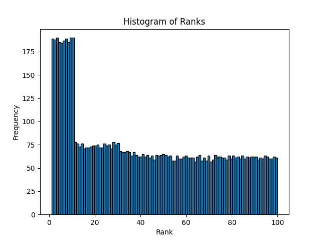
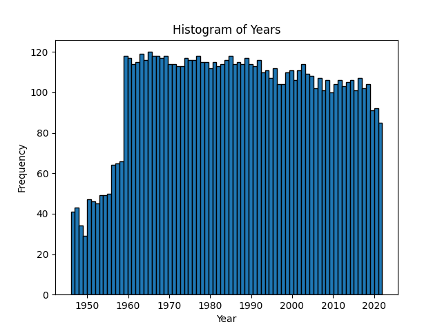
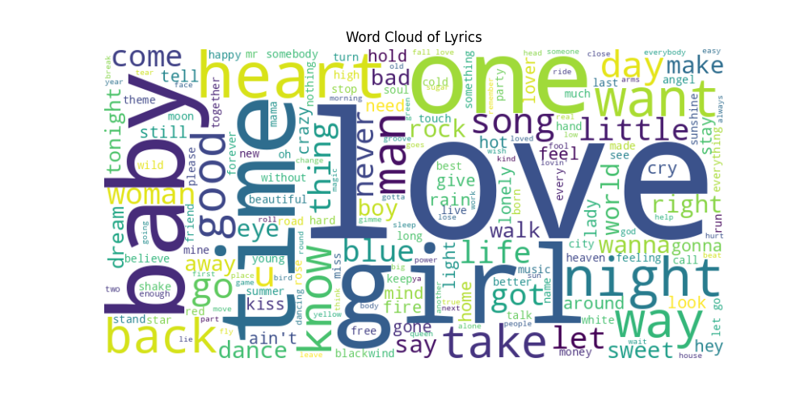
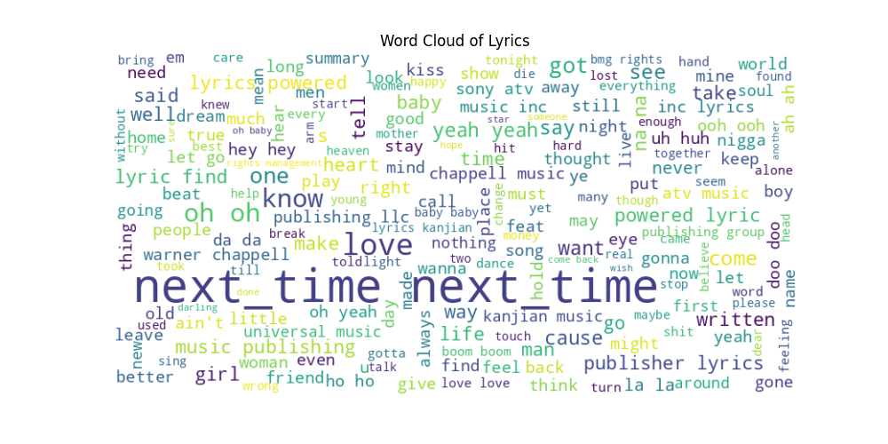

# Задание 1. Введение в сбор данных

Открытый датасет - https://www.kaggle.com/datasets/stefancomanita/top-us-songs-from-1950-to-2019-w-lyrics?select=topSongsLyrics1950_2019.csv

(Top 10 US songs for each year starting from 1950 to 2019, with lyrics.)

В файле [parse.py](parse.py) из статей Википедии взяты топ 100 песен каждого года - год, место, название, исполнитель. Результат сохранен в [файл](data/songs.csv).

В файле [dataset.ipynb](dataset.ipynb) по названию и исполнителю ищется текст песни на сайте http://www.lyricfinder.org (поиск проведен не до конца, еще не найденные песни помечены как NEXT_TIME). В конце файла произведена аггрегация открытого датасета с собранным, итоговый датасет сохранен в [файл](data/songs_with_lyrics.csv).

Возможные применения датасета:

 - Анализ трендов в музыке. Исследование эволюции музыкальных стилей и жанров со временем, выявление популярных тем, изучение популярности исполнителей, прогнозирование будущих трендов

 - Проведение сентимент-анализа  в текстах песен. Нахождение ключевых слов и тематик, присутствующих в популярных текстах

 - Обучение алгоритмов генерации текстов песен

## Анализ датасета

В файле [lda.ipynb](lda.ipynb) производится анализ датасета.

### Гистограмма распределения мест песен в датасете:

### Гистограмма распределения годов выпуска:

### Самые частотные слова в названиях песен:

love: 549  
like: 128  
get: 119  
one: 106  
i'm: 105  
time: 102  
heart: 99  
baby: 94  
girl: 88  
can't: 84  
go: 83  
night: 83  
want: 80  
way: 76  
back: 75  
little: 74  
good: 73  
got: 70  
man: 69  
rock: 64    

### Самые частотные слова в текстах песен:

love: 3012  
i'm: 2893  
like: 2320  
know: 1896  
got: 1685  
get: 1660   
one: 1395  
come: 1293  
lyrics: 1229  
oh,: 1172  
go: 1064  
find: 1019  
can't: 988  
make: 971  
want: 922  
yeah,: 915  
never: 911  

Здесь особенно видно, что датасету очень нужна очистка и продолжение поиска текстов

### Самые часто встречающиеся исполнители

Madonna, count: 36  
Drake, count: 33  
Elvis Presley, count: 32  
Dion, count: 32  
Beatles, count: 31  
War, count: 29  
Mariah Carey, count: 29  
Elton John, count: 28  
Rihanna, count: 28  
Michael Jackson, count: 27  
Janet, count: 27  